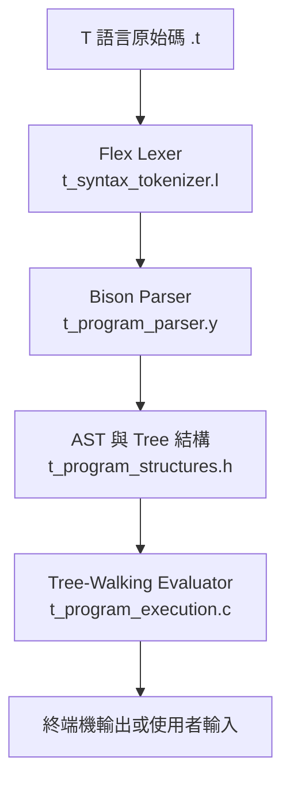

# T-Language Interpreter

## 1. 專案名稱與簡介（Project Title & Overview）

**T-Language Interpreter**

本專案以 C 語言、Flex 與 Bison 實作一個可解析並執行 T 語言程式的直譯器。

開發此專案是為了實作自訂程式語言從原始碼到執行結果的完整基本流程。它將 T 語言原始碼轉換為 Token、依語法規則建立抽象語法樹（Abstract Syntax Tree, AST），再走訪樹狀結構來執行程式。

使用者可透過 T 語言撰寫變數宣告、算術運算、條件判斷、輸入輸出與函式相關程式，並由本專案的可執行檔讀取及執行。

## 2. 功能特色（Features）

- 使用 Flex 進行詞彙分析，辨識關鍵字、識別字、整數、實數、字串、運算子與註解。
- 使用 Bison 定義 T 語言語法，解析程式、函式宣告與註解。
- 在剖析語法的同時建立 AST 節點，包含變數宣告、算術運算、條件判斷、輸入輸出、回傳與函式呼叫。
- 支援 `INT` 與 `REAL` 型別，以及 `+`、`-`、`*`、`/` 算術運算。
- 支援 `>`、`<`、`>=`、`<=`、`==`、`!=` 比較運算與 `IF ... ELSE` 條件敘述。
- 支援 `READ` 讀取整數或實數輸入，以及 `WRITE` 輸出字串與運算結果。
- 支援函式宣告、參數、函式呼叫與 `RETURN` 語法。
- 支援 `/* ... */` 形式的區塊註解。

## 3. 系統流程／架構（System Architecture）

```text
T 語言原始碼（.t）
        ↓
Flex Lexer：切分為 Token
        ↓
Bison Parser：依語法規則解析並建立 AST
        ↓
Tree-Walking Evaluator：走訪 AST、執行敘述
        ↓
終端機輸出／等待使用者輸入
```



- `t_syntax_tokenizer.l`：將原始碼切分為 Parser 可處理的 Token，例如 `INT`、`IF`、識別字與數值。
- `t_program_parser.y`：定義 T 語言的 grammar；成功比對規則時呼叫節點建立函式，將程式組成 AST。
- `t_program_structures.h`：宣告 AST 節點、函式與各種執行函式使用的資料結構。
- `t_program_execution.c`：建立 AST 節點，並以 `execute_tree()`、`execute_exprnode()` 等函式走訪與執行 AST。
- `t2c.c`：程式入口，開啟使用者指定的 `.t` 檔並呼叫 `yyparse()`。

## 4. 專案結構（Project Structure）

```text
T_Compiler/
├── .gitignore
├── Makefile
├── README.md
├── t2c.c
├── t2c.h
├── t_program_execution.c
├── t_program_parser.y
├── t_program_structures.h
├── t_syntax_tokenizer.l
├── test.t
├── test1.t
├── test2.t
├── test3.t
├── test4.t
├── test5.t
└── test7.t
```

| 檔案 | 用途 |
| --- | --- |
| `Makefile` | 定義產生 Parser、Lexer 與 `parse` 執行檔的建置規則。 |
| `t2c.c` | 主程式；讀取命令列指定的輸入檔並啟動 Parser。 |
| `t2c.h` | Lexer 與 Parser 共用的外部宣告。 |
| `t_syntax_tokenizer.l` | Flex Lexer 規則。 |
| `t_program_parser.y` | Bison Parser 語法規則與 AST 建立動作。 |
| `t_program_structures.h` | AST、函式樹與節點結構的宣告。 |
| `t_program_execution.c` | AST 節點建立與直譯執行邏輯。 |
| `test*.t` | T 語言範例程式，涵蓋條件判斷、輸入輸出、運算式與函式語法。 |
| `.gitignore` | 排除建置產生的執行檔、目的檔與 Flex/Bison 產生檔。 |

## 5. 安裝與快速開始（Installation & Quick Start）

### 必要工具

- GCC
- Flex
- Bison
- GNU Make

## 6. 使用範例（Usage / Examples）

建置完成後，傳入一個 T 語言原始碼檔：

```bash
./parse test.t
```

`test.t` 的內容如下：

```text
INT MAIN f1()
BEGIN
   IF(10<3)BEGIN
      WRITE(1, "output1");
      WRITE(2, "output2");
   END ELSE BEGIN
      WRITE(3, "output3");
      WRITE(4, "output4");
   END
END
```

因為 `10 < 3` 為假，直譯器會執行 `ELSE` 區塊。程式目前會先輸出 Parser 的規則追蹤訊息，最後可看到：

```text
Parsed OK!
output3 3
output4 4
```

可改用其他範例檔執行：

```bash
./parse test3.t
./parse test5.t
```

其中含有 `READ` 的範例會在終端機顯示訊息並等待使用者輸入數值。
